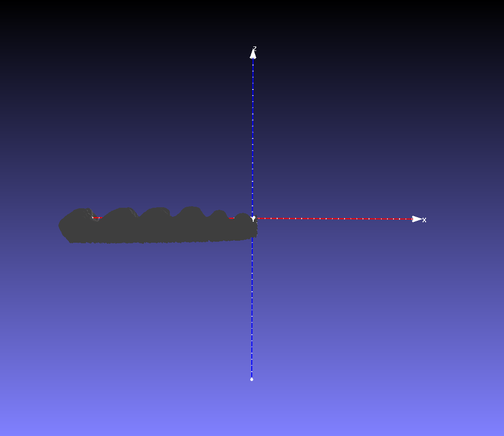
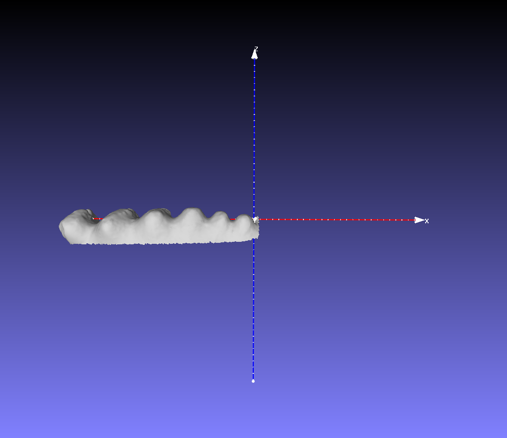
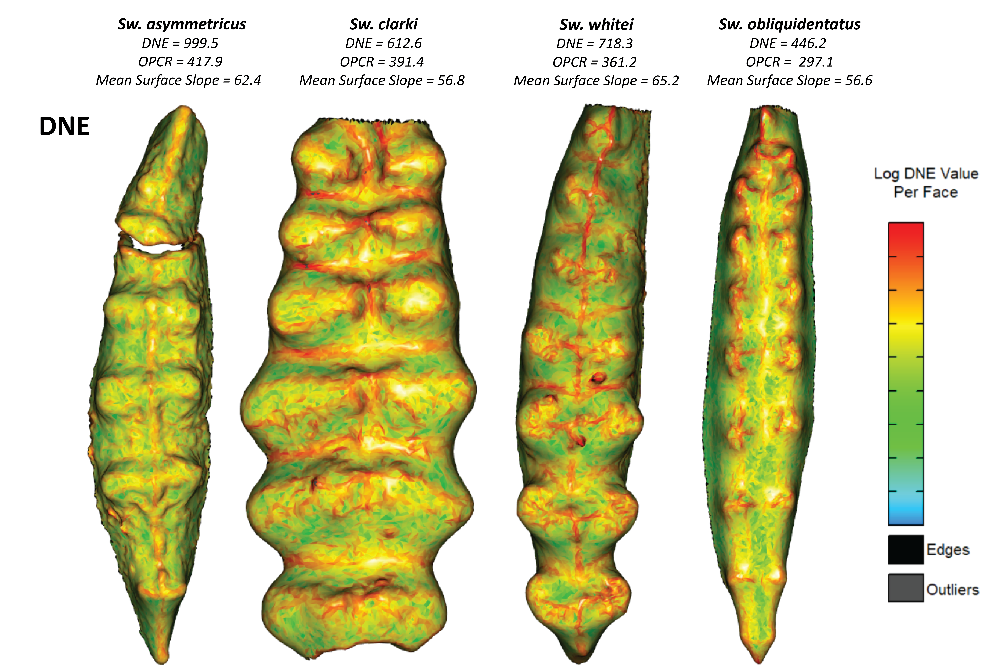
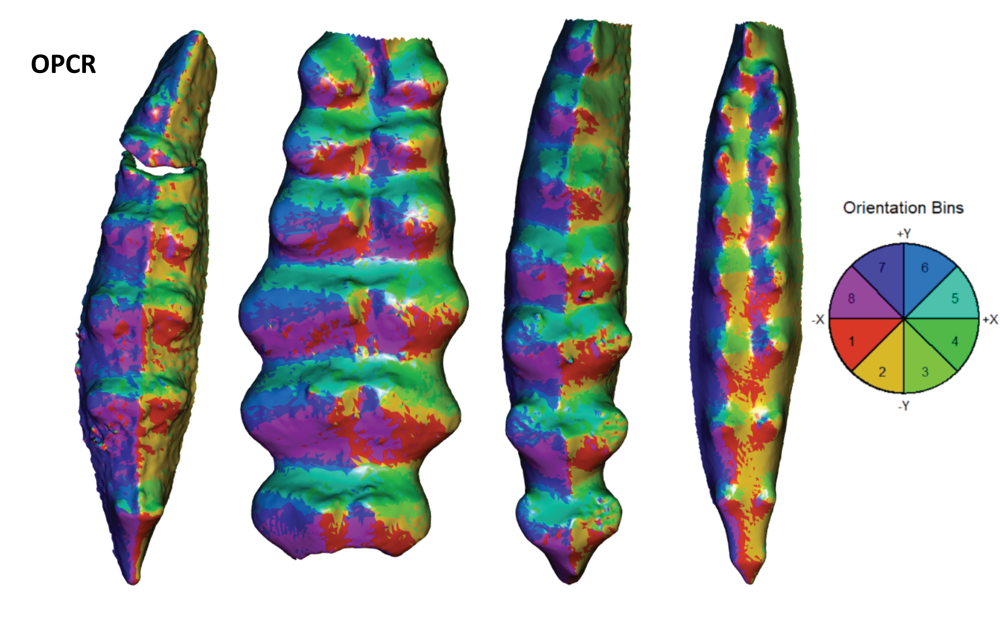
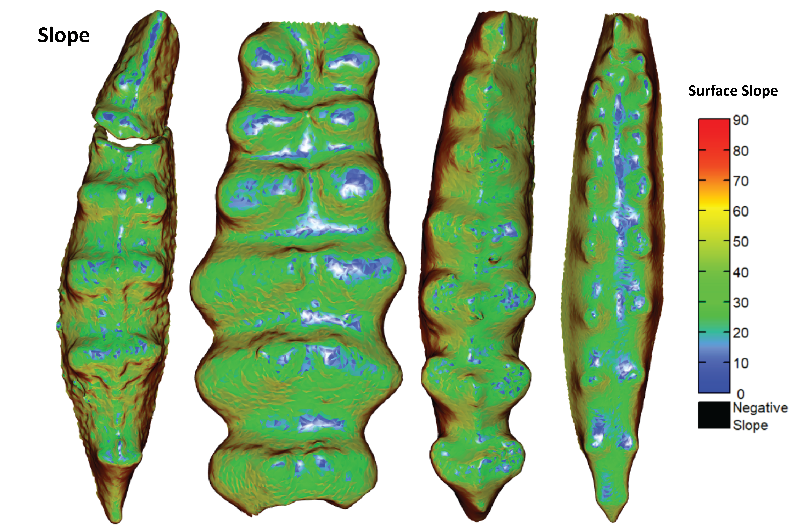

# MSc Future Work

Repo contains 3D meshes and analysis code for the future work sections in my MSc thesis.

Code for two future work recommendations from MSc thesis.

## Ornstein-Uhlenbeck with Time-Averaging

Effects of time-averaging on a Ornstein-Uhlenbeck (OH) process to demonstrate the occurance of parallel evolution in fossil data. After the model is run over a certain amount of iterations for a species-pair, the angle between the vectors connecting the time bins is calculated. Code written in python and run from Spyder 4.

### Methods

* OH process modeled using Euler-Maruyama method from IPython Interactive Computing and Visualization Cookbook, Second Edition (2018), by Cyrille Rossant.
* Oscillating mean modeled using a sine wave. Mu (line 65 in RandomEvolutionModel.py) value in OH equation substituted with sine equation (Line 61 in RandomEvolutionModel.py). You can substitute any oscillating function for the sine function if desired.
* Paired OH processes are then run over a desired number of iterations to model two separately evolving lineages of species-pairs (OH run for 10,000 steps; 100 paired iterations run)
* Iterations for OH runs are then binned, and vectors between bins are calculated for each lineage in an iteration. The angle between vectors for each successive bin are then calculated for different bin values.
* Results are then plotted in a histogram to illustrate distribution of vector angles between different bin values.

### Results

*Figure 1: Demonstrating the effect of time-averaging on the prevalence of parallel evolutionary trends in fossil data. Lower number of bins correlates to higher degrees of time-averaging.*

## Calculating Dental Complexity

Using the molaR package in R studio I calculated the changes in slope between *Sweetongnathus* dental platform elements. Code written in R and run from R Studio.

### Processing Steps

The steps used to preprocess each mesh in MeshLab are as followed:
a) Align meshes such that occlusal surface was perpendicular in the positive z-direction (posterior end of the conodont pointing towards negative x-direction). Before saving mesh file, freeze mesh orientation using *Matrix: Freeze Current Matrix* function.
b) Meshes were cropped to only include the platform carina. Non manifold edges were removed using the MeshLab function *Repair non Manifold Edges by removing faces*, and any small holes were filled using the MeshLab function *Close Holes*.
c) Meshes were simplified using the MeshLab function *Simplification: Quadric Edge Collapse Decimation* to 19,000 faces for each mesh. Function was set to preserve topology, to find the optimal position of simplified vertices, and post-simplication cleaning. Quantity threshold was set to 0.3, boundary position weight to 1, planar simp. weight to 0.001, and all other setting on default.

Note: In some cases the molaR::slope function cannot choose the correct face for slope calculation, or the molaR::OPC orientates patchs incorrectly. This may be due to your mesh surface being inverted (i.e., the functional surface is on the internal side of the mesh). To check if mesh is correctly orientated, check that the mesh single back-face in MeshLab is the true functional/occlusal surface. If it isn't, invert the mesh using the *Invert Faces Orientation* function. The below figures illustrate the incorrect and correct face orientation for use in molaR.

The above figure shows a mesh with its face orientated towards the inside.

The above figure shows a properly orientated mesh with the functional surface orientated towards the outside. Use the *Invert Faces Orientation* function to invert mesh faces.

### Results obtained from molaR analysis methods

DNE, OPCR, and Surface Slope results are presented below for each of the four species analyzed.

When the distribution of triangle slopes are analyzed, one can see parallel trends between the two lineages, whereby we can see an increase in near flat surfaces on each element.

More work however needs to be done. This should be an outline for future exploration.
